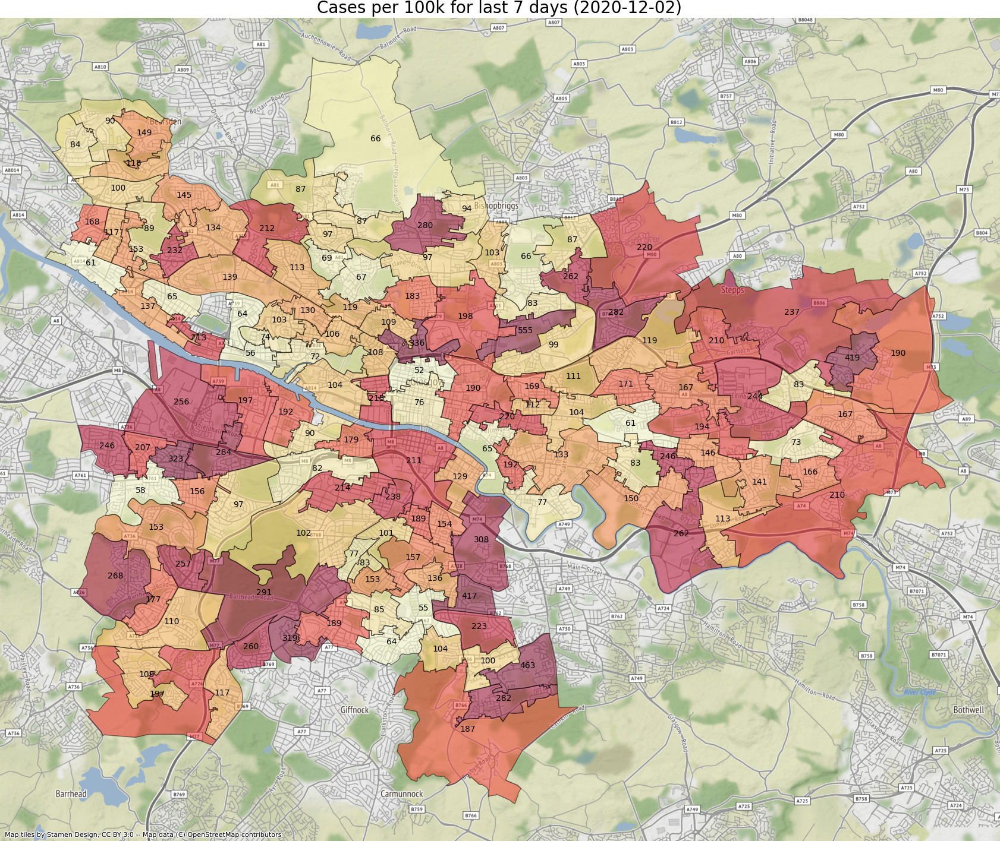
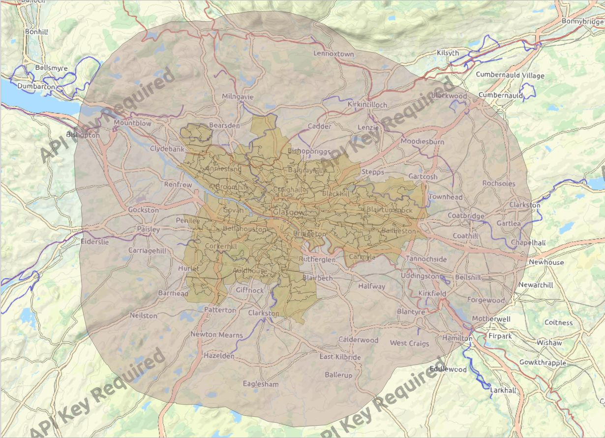

# covid19

Experiments in plotting Covid-19 data

## Requirements

```
sudo apt install imagemagick
cd scripts
virtualenv -p /usr/bin/python3 env
source env/bin/activate
python3 -m pip install pandas geopandas matplotlib contextily mapclassify descartes bs4
```

## Scrape data from the Public Health Scotland dashboard

The PHS dashboard:

https://public.tableau.com/profile/phs.covid.19#!/vizhome/COVID-19DailyDashboard_15960160643010/Overview

All the data has been made public on this dashboard but I don't like the visualisation so here's a script to scrape the data and visualise it differently. Note that PHS has already reduced the quality of the data to preserve privacy, for example where there's less than 5 cases in a zone they report "1-4" so this script uses a value of 3 instead.

The dashboard divides Scotland into regions (local authorities) and within each region there are Intermediate Zones of roughly equal population. The script queries a subset of the regions (you can modify it with more) and downloads the numbers for each zone into a CSV file. The CSV files are dated so you can run the script each day.

Run `scripts/scrape_phs_covid.py` to scrape the data - three regions are defined in the script but you can change them. It will write one CSV file per region. Each row in the file has four columns: Per100k,Cases,Pop,IZ (cases per 100k population in the last seven days, cases in the last 7 days, population of the IZ, name of the IZ)

## Plotting the data

* Split the shapefile of intermediate zones into separate files, one for each local authority
 using the `scripts/filter_iz_shapefile_to_city.sh` script (for all of them) or `scripts/filter_iz_shapefile_to_city.py` (for just a single one)
* Use the `plot_city.py` script

Or using QGIS

* Load the shapefile of intermediate zones into QGIS
* Load the CSV file as a vector layer
* Open the properties of the shapefile layer and in the Join tab make a join with the CSV layer, using the IZ name as the join key
* Open the layer styling and change from point to categorical, select the newly joined attribute Per100k, change colour, make transparent
* Install the QuickWebMap plugin and use the Web menu to add OSM mapping underneath

## Example



## Five miles

You are allowed to travel five miles from the boundary of your local authority.
Create a map showing the boundary of each local authority extended by five miles.

* Download the shapefiles (see below)
* Use the `scripts/files_miles.py` script to create a map.

To do it manually in QGIS:

* Open the shapefile for your local authority (not whole Scotland!) in QGIS
* Vector | Geoprocessing tools | Buffer - use 5 and select Miles
* Vector | Geoprocessing tools | Dissolve - to get a single shape
* Change the shape to be transparent
* As above use the OSM map underneath



## List of Regions

The data about the Intermediate Zones can be downloaded from
https://www.opendata.nhs.scot/dataset/geography-codes-and-labels/resource/e3e885cc-2530-4b3c-bead-9eda9782264f
as a CSV file:
https://www.opendata.nhs.scot/datastore/dump/e3e885cc-2530-4b3c-bead-9eda9782264f?bom=True

* 'Aberdeen City'
* 'Aberdeenshire'
* 'Angus'
* 'Argyll and Bute'
* 'City of Edinburgh'
* 'Clackmannanshire'
* 'Dumfries and Galloway'
* 'Dundee City'
* 'East Ayrshire'
* 'East Dunbartonshire'
* 'East Lothian'
* 'East Renfrewshire'
* 'Falkirk'
* 'Fife'
* 'Glasgow City'
* 'Highland'
* 'Inverclyde'
* 'Midlothian'
* 'Moray'
* 'Na h-Eileanan Siar'
* 'North Ayrshire'
* 'North Lanarkshire'
* 'Orkney Islands'
* 'Perth and Kinross'
* 'Renfrewshire'
* 'Scottish Borders'
* 'Shetland Islands'
* 'South Ayrshire'
* 'South Lanarkshire'
* 'Stirling'
* 'West Dunbartonshire'
* 'West Lothian'

## Shapefiles

Download Intermediate Zone boundaries from

https://www.spatialdata.gov.scot/geonetwork/srv/eng/catalog.search#/metadata/389787c0-697d-4824-9ca9-9ce8cb79d6f5
as a Shapefile:
http://sedsh127.sedsh.gov.uk/Atom_data/ScotGov/ZippedShapefiles/SG_IntermediateZoneBdry_2011.zip

## To do

* Try a streamlit web app
* Make it interactive
* Some of the zones in Perthshire are small relative to the size of the local authority so the numbers cannot be read.

